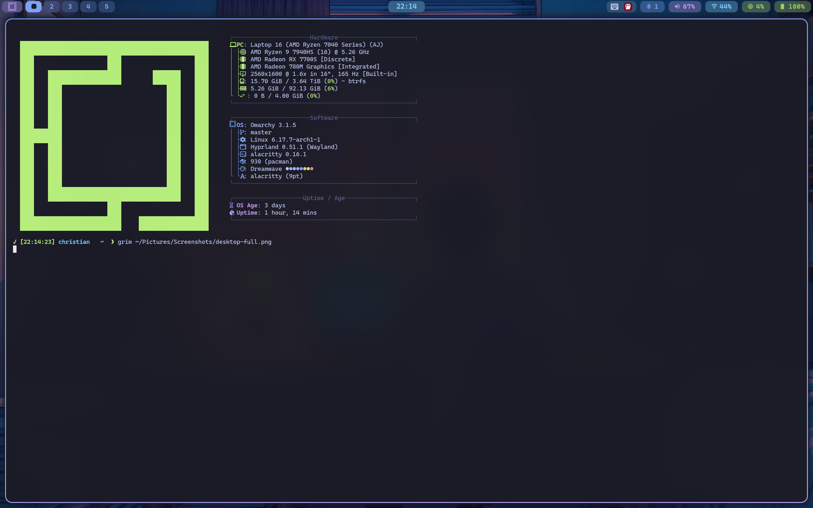
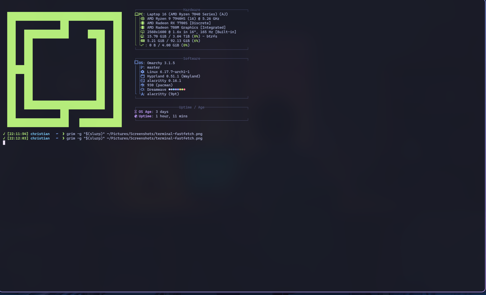

# My Omarchy Tokyo Night Dotfiles 🌃

Personal Arch Linux (Omarchy) configuration with Tokyo Night theme.



## 🎨 Setup
- **OS:** Arch Linux (Omarchy)
- **WM:** Hyprland
- **Theme:** Tokyo Night Storm
- **Terminal:** Alacritty
- **Editor:** LazyVim (Neovim)
- **Bar:** Waybar
- **Browser:** Brave
- **Shell:** Bash
- **VPN:** Mullvad WireGuard

## 📸 Screenshots

### Waybar


### Terminal with Fastfetch


## 🔒 Security Features
- Full disk encryption (LUKS2)
- Mullvad VPN with split tunneling for Discord
- fail2ban intrusion prevention
- DNSOverTLS with Quad9
- Auto-lock after 5 minutes
- UFW firewall configured

## 🚀 Modern Tools
- **exa** - Better ls with colors and icons
- **bat** - Better cat with syntax highlighting
- **fd** - Better find
- **fzf** - Fuzzy finder
- **cliphist** - Clipboard manager
- **grim + slurp + swappy** - Screenshot tools

## ⌨️ Key Features
- 158+ custom bash aliases
- Screenshot keybindings (Super+S combinations)
- Workspace organization (terminals, editors, browsers, etc)
- Tokyo Night colors throughout
- Blur, shadows, and smooth animations

## 📁 Structure
```
dotfiles/
├── screenshots/           # Desktop screenshots
├── config/
│   ├── hypr/             # Hyprland configs (7 files)
│   ├── waybar/           # Waybar config + styling
│   ├── alacritty/        # Terminal config
│   └── nvim/             # LazyVim cheat sheet
├── bashrc                # Bash configuration
├── bashrc_aliases        # 158+ custom aliases
├── install.sh            # Automated installation script
└── CHANGELOG.md          # Version history
```

## 💾 Installation

### Prerequisites (Arch Linux)
```bash
# Install required packages
sudo pacman -S hyprland waybar alacritty neovim git
sudo pacman -S grim slurp swappy wl-clipboard  # Screenshots
sudo pacman -S exa bat fd fzf                   # Modern tools
```

### Clone and Install
```bash
# Clone the repository
git clone https://github.com/WidkidoneR2/omarchy-dotfiles.git
cd omarchy-dotfiles

# Run the install script (creates symlinks)
./install.sh

# Reload configurations
hyprctl reload
source ~/.bashrc
```

### Manual Installation
If you prefer manual setup:
```bash
# Backup existing configs
cp ~/.config/hypr/hyprland.conf ~/.config/hypr/hyprland.conf.backup

# Create symlinks
ln -sf ~/omarchy-dotfiles/config/hypr/* ~/.config/hypr/
ln -sf ~/omarchy-dotfiles/config/waybar/* ~/.config/waybar/
ln -sf ~/omarchy-dotfiles/config/alacritty/alacritty.toml ~/.config/alacritty/
ln -sf ~/omarchy-dotfiles/bashrc ~/.bashrc
ln -sf ~/omarchy-dotfiles/bashrc_aliases ~/.bashrc_aliases
```

## 🎮 Keybindings

### Screenshots
- `Super + S` - Full screen screenshot
- `Super + Alt + S` - Select area screenshot
- `Super + Ctrl + S` - Screenshot to clipboard
- `Super + Shift + S` - Screenshot with editor

### Workspaces
- `Super + 1-5` - Switch to workspace
- `Super + Shift + 1-5` - Move window to workspace

### Applications
- `Super + Return` - Terminal
- `Super + Shift + B` - Browser
- `Super + Shift + V` - VSCode
- `Super + P` - Clipboard history

See [config/hypr/bindings.conf](config/hypr/bindings.conf) for complete list.

## 🔧 Customization

### Changing Colors
Tokyo Night colors are defined in:
- `config/hypr/looknfeel.conf` - Window borders, shadows
- `config/waybar/style.css` - Status bar colors
- `config/alacritty/alacritty.toml` - Terminal colors

### Machine-Specific Settings
Edit `config/hypr/monitors.conf` for your display setup.

## 📖 Learn More
- [LazyVim Cheat Sheet](config/nvim/lazyvim-cheatsheet.md)
- [CHANGELOG](CHANGELOG.md) - Version history
- [Hyprland Docs](https://wiki.hyprland.org/)

## 📄 License
MIT License - Feel free to use and modify!

## 🙏 Credits
- [Tokyo Night Theme](https://github.com/tokyo-night/tokyo-night-vscode-theme)
- [Hyprland](https://hyprland.org/)
- [Omarchy](https://omakub.org/) - Base distribution

---
**Last Updated:** November 4, 2025
